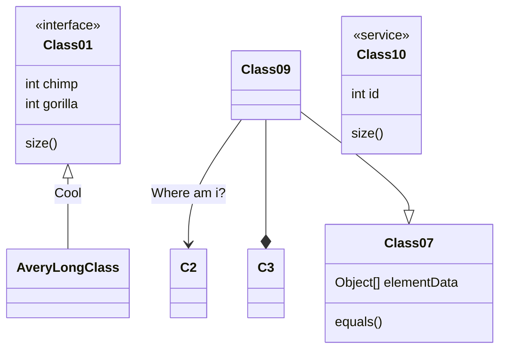
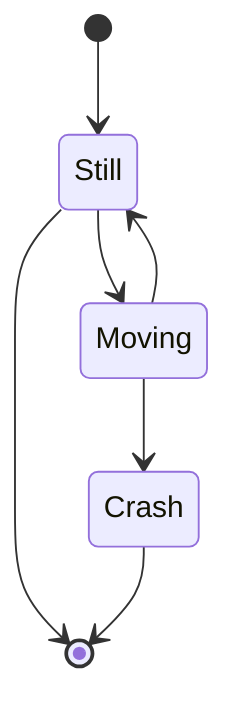

This is SysML


$$\Gamma(z) = \int_0^\infty t^{z-1}e^{-t}dt\,.$$   (for display)
\\[\Gamma(z) = \int_0^\infty t^{z-1}e^{-t}dt\,.\\] (also for display)
\\(\Gamma(z) = \int_0^\infty t^{z-1}e^{-t}dt\,.\\) (for inline)


Term 1
Term 2
:   Definition Akkk
:   Definition B

$\Gamma(n) = (n-1)!\quad\forall n\in\mathbb N$


```puml
a->b
```





```sequence {theme="hand"}
a -> b: test
```
